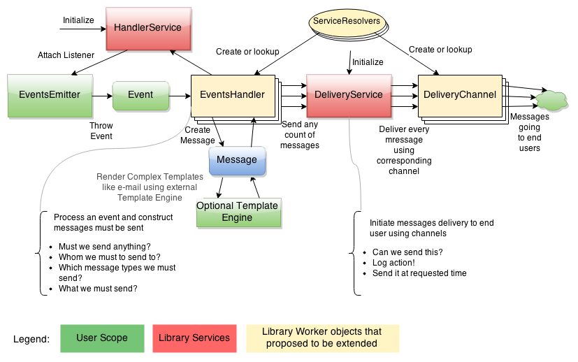

# Smart Notification Service

Smart Notification Service is a PHP-written library to organize well-structured notification delivery system based on events in business-logic code.

System designed to be framework independent and highly customizable and extendable. Library brings an action flow for notifications sending and gives to programmer responsibility to write custom event handlers (messages creation) and delivery channels (messages sending). There are few delivery channels available out of the box.

Notification sending action flow
--------------------------------

Project status
--------------

Smart Notification Service is currently under development and is not ready for production use.

Author
------

Library author and developer: Valera Leontyev (feedbee@gmail.com).

License
-------

BSD-3. Feel free to use and modify the code, even for commercial purposes.